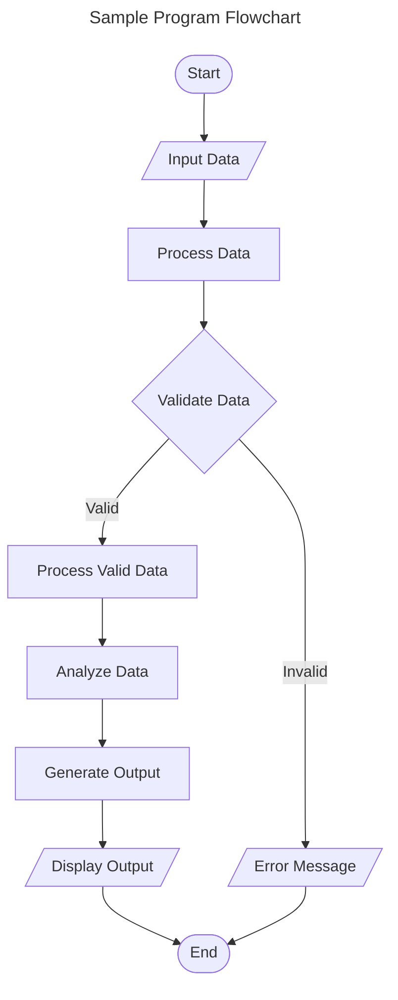

# Specification Document

Please fill out this document to reflect your team's project. This is a living document and will need to be updated regularly. You may also remove any section to its own document (e.g. a separate standards and conventions document), however you must keep the header and provide a link to that other document under the header.

Also, be sure to check out the Wiki for information on how to maintain your team's requirements.

## TeamName

<!--The name of your team.-->
Controlled Chaos

### Project Abstract

<!--A one paragraph summary of what the software will do.-->

This software will provide the user with an intereactive **text-based** choose your own adventure style game, it will prompt the user to make decisions and return reactions or consequences depending on the input of the user, allowing them to create their own unique experience. The user will be directed through various in game places, discussions, possible actions they can take, etc. There will be many different possible ending for the user to find!

The user will make most of their choices through a 2 choice system, where their input places them within a unique scenario. The user will have an hp bar, inventory, as well as a map to help them on their adventure.

<!-- This is an example paragraph written in markdown. You can use *italics*, **bold**, and other formatting options. You can also <u>use inline html</u> to format your text. The example sections included in this document are not necessarily all the sections you will want, and it is possible that you won't use all the one's provided. It is your responsibility to create a document that adequately conveys all the information about your project specifications and requirements. -->

<!-- Please view this file's source to see `comments` with guidance on how you might use the different sections of this document.  -->

### Customer

The customer that may use this software is someone that enjoys text-based activities, they may be a big fan of reading but want to make it more interesting by chosing their own outcomes. The customer will see that they are provided with many paths to take, decisions to make, and flexibility in what they wish to do within the software.

<!--A brief description of the customer for this software, both in general (the population who might eventually use such a system) and specifically for this document (the customer(s) who informed this document). Every project will have a customer from the CS506 instructional staff. Requirements should not be derived simply from discussion among team members. Ideally your customer should not only talk to you about requirements but also be excited later in the semester to use the system.-->

### Specification

<!--A detailed specification of the system. UML, or other diagrams, such as finite automata, or other appropriate specification formalisms, are encouraged over natural language.-->

<!--Include sections, for example, illustrating the database architecture (with, for example, an ERD).-->

<!--Included below are some sample diagrams, including some example tech stack diagrams.-->

#### Technology Stack


```mermaid
flowchart RL
subgraph Front End
	A(React, JS, CSS, HTML)
end
	
subgraph Back End
	B(Java: SpringBoot)
end
	
subgraph Database
	C[(MySQL), Docker]
end

A <-->|HTTP| B
B <--> C
```

#### Flowchart




### Standards & Conventions

[Style Guide & Conventions](STYLE.md)

## Docker

This project uses Docker for easy setup and deployment. See [DOCKER.md](DOCKER.md) for instructions on how to run the application using Docker.
